# practicaGIT1
## Crearcion del repositorio
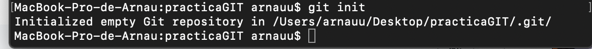
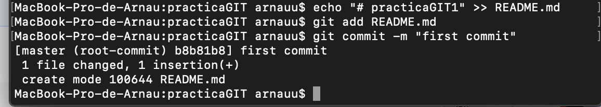
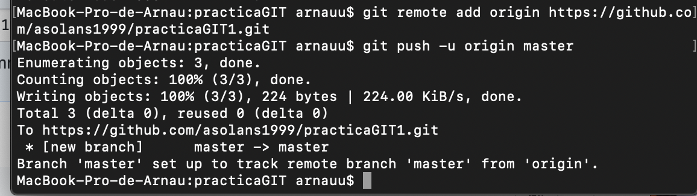

## Creacion del documento, modificación y vuelta al principio

Creamos el documento y lo añadimos al repositorio local
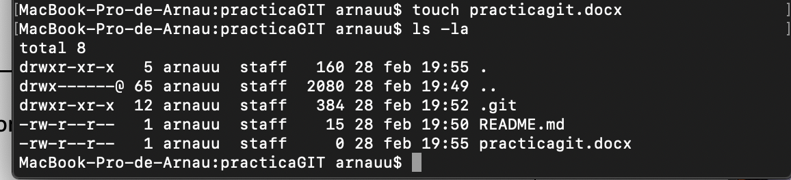
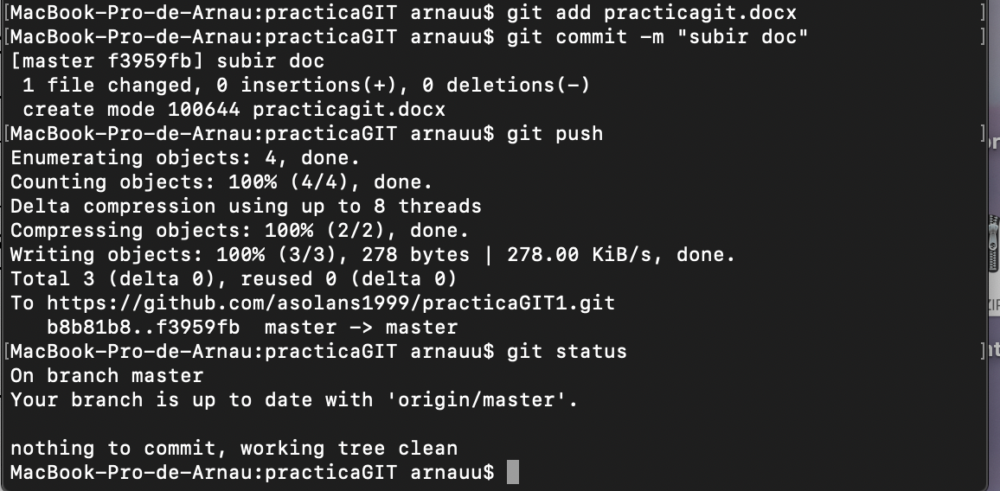
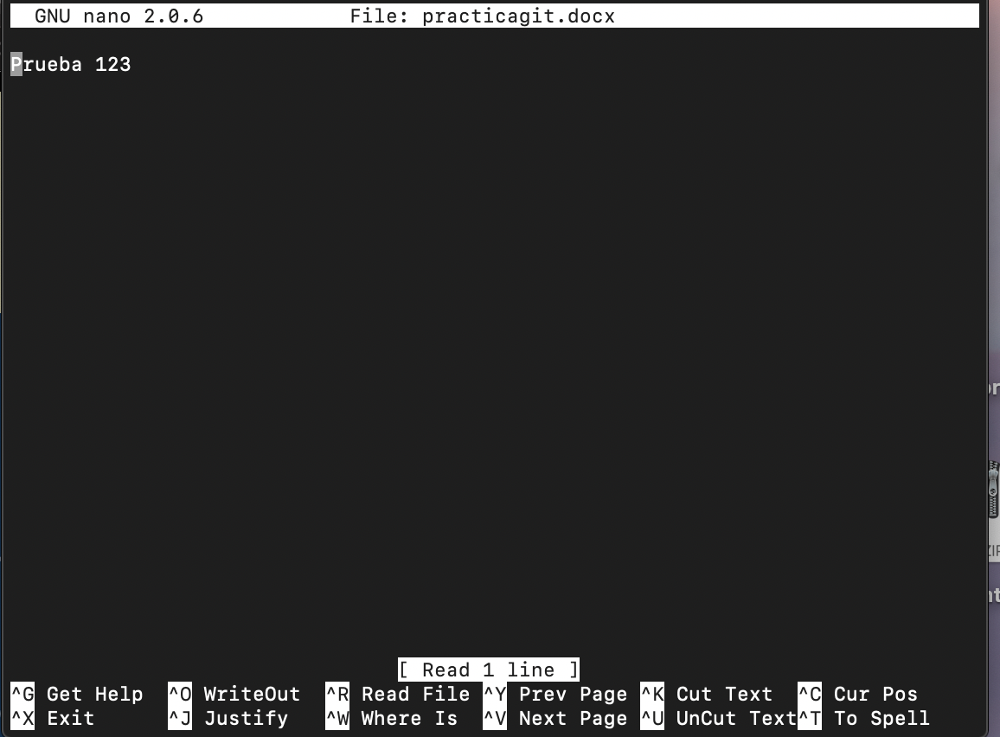

Modificamos el fichero y lo subimos

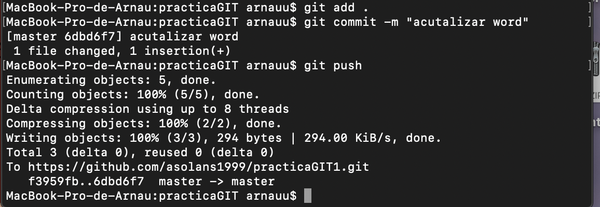
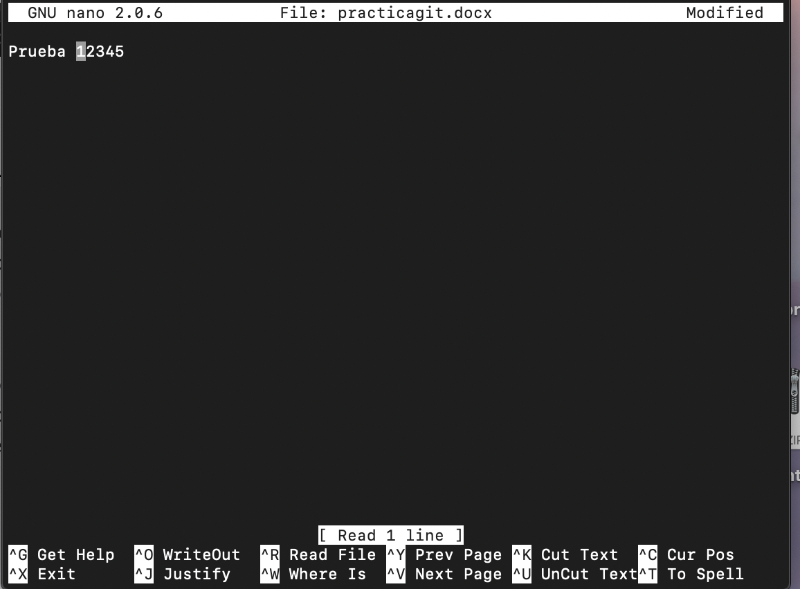

Hacemos un checkout a la version anterior

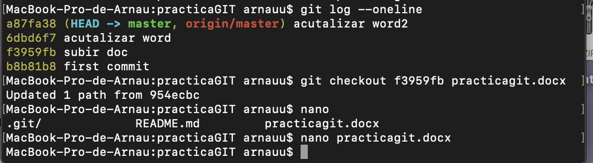

## GitIgnore

Creamos el archivo .ignore
Creamos la carpeta personal
Añadimos el nombre de la carpeta al fichero .ignore escribiendo personal/ en dicho archivo 

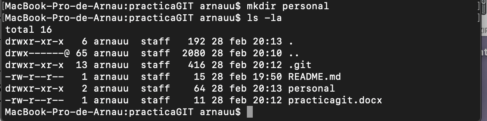
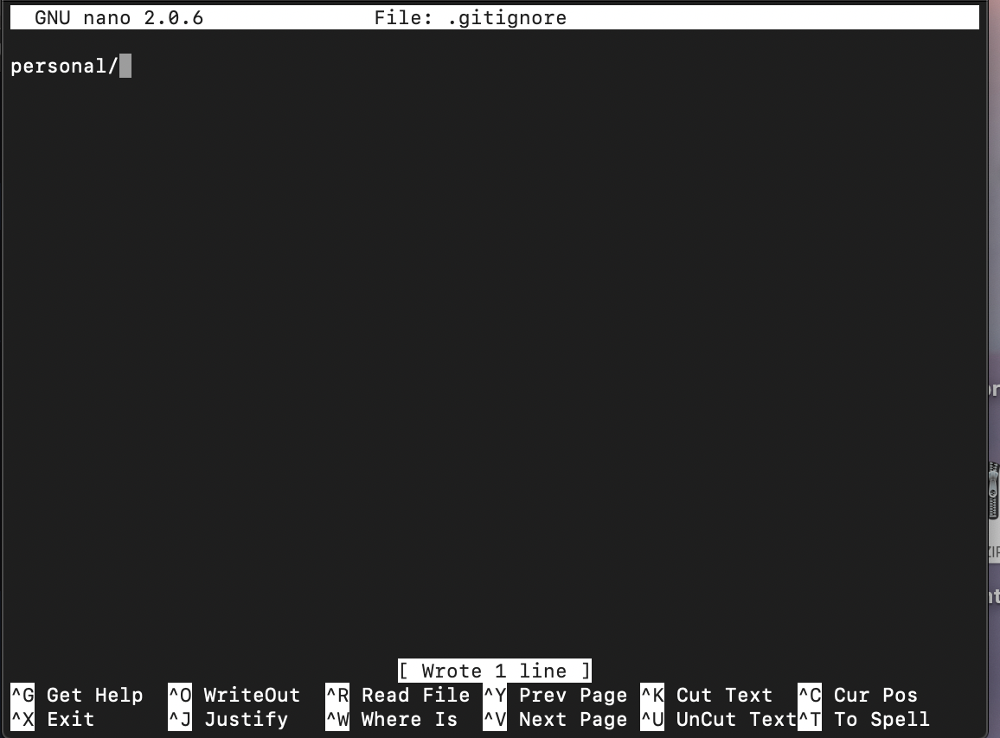

## GIT LOG

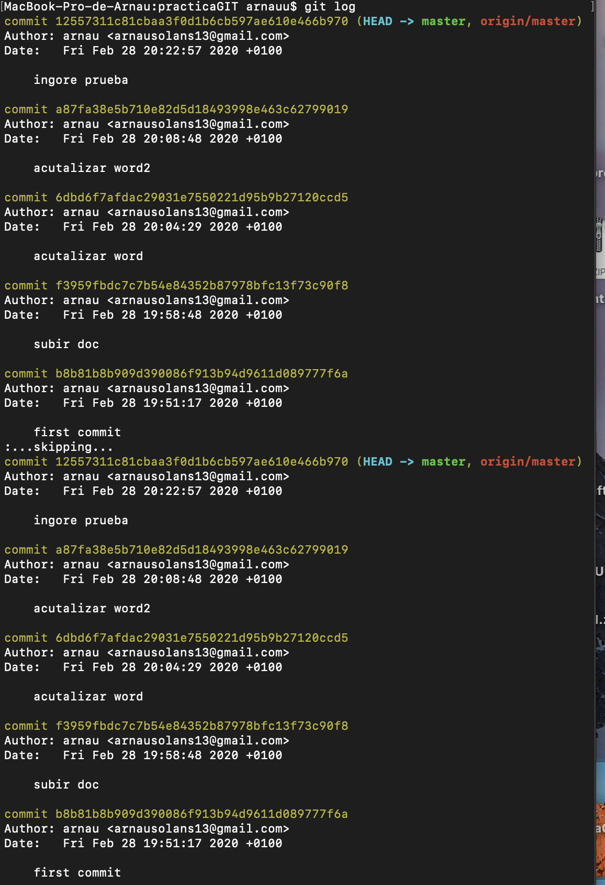

